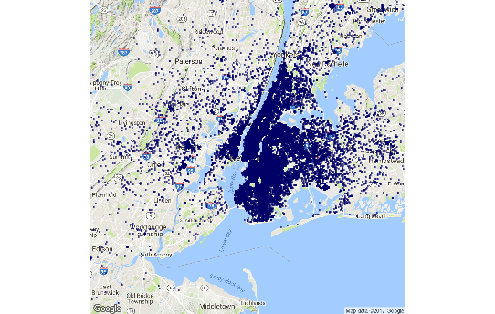
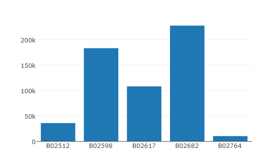
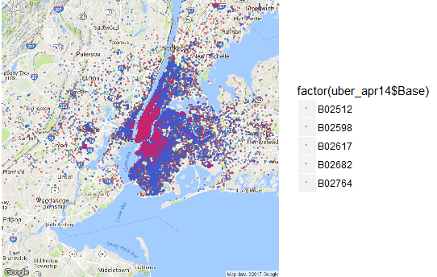
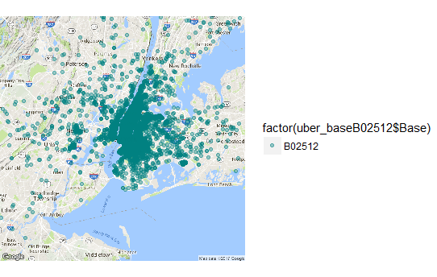
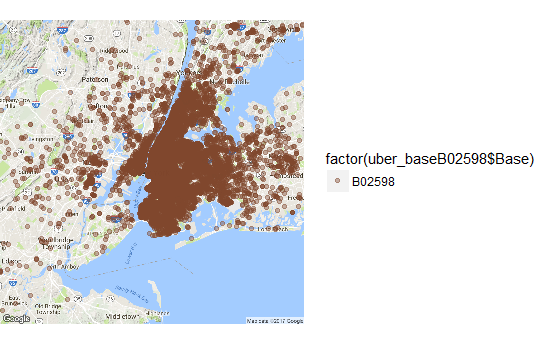
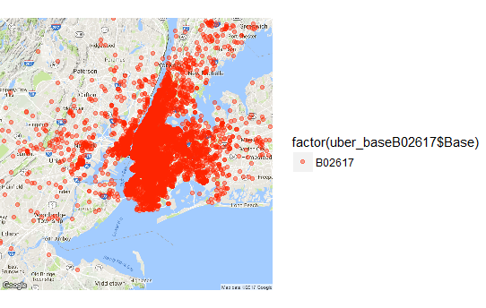
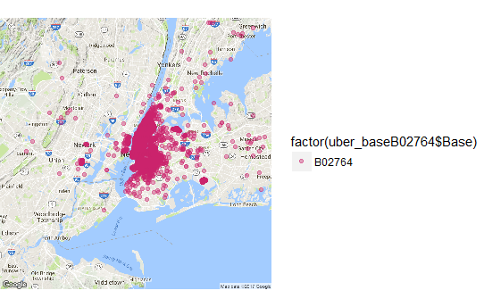

# UBER PICKUPS IN NEW YORK CITY
## Data visualization using R  

## Contributors:
+ Shon Inouye
+ Edward Kim

## Abstract
This repo is dedicated to create data visualization for uber and other for-hire vehicle pickups in New York City. We used datasets from [Kaggle](https://www.kaggle.com/fivethirtyeight/uber-pickups-in-new-york-city). The goal of this project was to visualize the data in different ways and point out any interesting discoveries.
The data came with some missing values, so the first step in the project was to clean the data into something usable. One thing that was ambiguous at first were the base codes that accompanied each uber pickup. A quick search led to these codes being associated with several of Uber's bases.

Base Code | Base Name
---|---------
B02512 | Unter
B02598 | Hinter
B02617 | Weiter
B02682 | Schmecken
B02764 | Danach-NY
B02765 | Grun
B02835 | Dreist
B02836 | Drinnen

These are Uber's bases located in New York. Each uber pickup is affiliated with a TLC(Taxi and Limousine Commission) company base. 

### Loading Packages

    library(ggplot2)
    library(plotly) #used along with ggplot2 for data visualization.
    library(ggmap)  #used for geocoding
    library(plyr)   #used along with dplyr to aggregate data
    library(dplyr)

### Overview of Uber Pickups
First, we wanted to take a look at the distribution of pickup points throughout New York City. 

    apr14_plot <- geom_point(data = uber_apr14, 
                         aes(x = Lon, y = Lat), 
                         colour = '#FF3333',
                         size = 0.1, alpha = 0.5, na.rm = TRUE)

    nyMap <- qmap("New York City")
    
    fullMap <- nyMap + apr14_plot
    fullMap

### Uber Pickups by TLC Base Code
With every Uber pickup, there is a TLC base company code that is associated with it. To get a better understanding of what these codes mean, we created a bar graph of the number of pickups for each base code.

    ### SEPARATING DATA BASED ON UBER BASE ###
    uber_baseB02512 <- filter(uber_apr14, Base == "B02512")
    uber_baseB02598 <- filter(uber_apr14, Base == "B02598")
    uber_baseB02617 <- filter(uber_apr14, Base == "B02617")
    uber_baseB02682 <- filter(uber_apr14, Base == "B02682")
    uber_baseB02764 <- filter(uber_apr14, Base == "B02764")

    ## CREATE BAR GRAPH OF UBER DATA BY BASE ###
    numrow_B02512 <- nrow(uber_baseB02512)
    numrow_B02598 <- nrow(uber_baseB02598)
    numrow_B02617 <- nrow(uber_baseB02617)
    numrow_B02682 <- nrow(uber_baseB02682)
    numrow_B02764 <- nrow(uber_baseB02764)

    basedata <- plot_ly(x = c("B02512", "B02598", "B02617", "B02682", "B02764"),
                    y = c(numrow_B02512, numrow_B02598, numrow_B02617, numrow_B02682, numrow_B02764),
                    name = "Uber Pickups by TLC Base Code",
                    type = "bar")
    basedata

Here, we can see that there is a very large difference between the number of pickups for each base code. Base codes B02682 (Schmecken) and B02598 (Hinter) have over 150,000 pickups in the month of April while base codes B02512 (Unter) and B02764 (Danach-NY) do not even reach 50,000 pickups.
Now, we can plot the pickup points on a map and distinguish them based on their base codes.

    ###PLOT BY BASES
    base_plot <- nyMap + 
      geom_point(data = uber_apr14, 
             mapping = aes(x = Lon, y = Lat, colour = factor(uber_apr14$Base)), 
             size = 0.1, alpha = 0.4, na.rm = TRUE) + 
      scale_color_manual(values = c("#008080", "#7F462c", "#FF2400", "#2B60DE", "#CA226B"))

    base_plot

We can also plot the pickups for each base individually in order to see which areas these codes cover.

    ### PLOT DATA BY UBER BASE ###
    #Base B02512
    base_B02512 <- nyMap + 
      geom_point(data = uber_baseB02512, 
             mapping = aes(x = Lon, y = Lat,  colour = factor(uber_baseB02512$Base)), 
             alpha = 0.4, na.rm = TRUE) +
      scale_color_manual(values = c("#008080"))

    #Base B02598
    base_B02598 <- nyMap + 
      geom_point(data = uber_baseB02598, 
             mapping = aes(x = Lon, y = Lat,  colour = factor(uber_baseB02598$Base)), 
             alpha = 0.4, na.rm = TRUE) +
      scale_color_manual(values = c("#7F462c"))

    #Base B02617
    base_B02617 <- nyMap + 
      geom_point(data = uber_baseB02617, 
             mapping = aes(x = Lon, y = Lat,  colour = factor(uber_baseB02617$Base)), 
             alpha = 0.4, na.rm = TRUE) +
      scale_color_manual(values = c("#FF2400"))

    #Base B02682
    base_B02682 <- nyMap + 
      geom_point(data = uber_baseB02682, 
             mapping = aes(x = Lon, y = Lat,  colour = factor(uber_baseB02682$Base)), 
             alpha = 0.4, na.rm = TRUE) +
      scale_color_manual(values = c("#2B60DE"))

    #Base B02764
    base_B02764 <- nyMap + 
      geom_point(data = uber_baseB02764, 
             mapping = aes(x = Lon, y = Lat,  colour = factor(uber_baseB02764$Base)), 
             alpha = 0.4, na.rm = TRUE) +
      scale_color_manual(values = c("#CA226B"))

    plot(base_B02512)
    plot(base_B02598)
    plot(base_B02617)
    plot(base_B02682)
    plot(base_B02764)

## Overview of Total Pickups 

